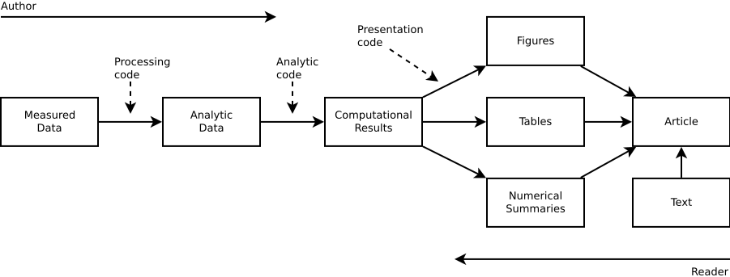

# Today's talk

## Reproducible Research

## Tools to eaze your work

We will spend most time looking at other people's work

---
background-image: url("http://giphygifs.s3.amazonaws.com/media/88VqLDyQttwpa/giphy.gif")

---

## Reproducible research (RR) (or how to avoid "it works on my computer!")

--

**A major new issue in sciences (overall)**

* Accessible Reproducible Research ([Mesirov, __Science__ 2010](http://science.sciencemag.org/content/327/5964/415))

* Again, and Again, and Again, ... ([Jasny et al., __Science__ 2011](http://science.sciencemag.org/content/334/6060/1225))

* Challenges in Irreproducible Research ([__nature__ topic](http://www.nature.com/news/reproducibility-1.17552))

* Reproducibility of computational workflows is automated using continuous analysis ([Beaulieu-Jones & Greene, __nature biotechnology__ 2017](https://www.nature.com/articles/nbt.3780?foxtrotcallback=true))

--

**A Major productivity problem for researchers**

* It is not only a good idea for science, but also for saving you time!

---

# Reproducible research

--

**Polished paper**

-  Ready to be submitted

-  Written using your fav doc editor

--

**Intermediate report**

-  Not ready to be published

-  Not necesarily using your fav doc editor

What do these two have in common?

---
background-image: url("http://www.phdcomics.com/comics/archive/phd012618s.gif")
class: center, top, inverse

... both should have pretty figures AND be
reproducible

---

# The minimum

**Data** people must have a way to get your data

-  Include it with the paper.

-  Put it on a repo online like [zenodo](https://zenodo.org).

-  Include instructions about how to get the data (e.g. in an experimental
   setting, how did you get the samples).

--

**Analysis** source code/steps of your analysis

-  Include it with the paper

-  Put it on a repo online like [Github](https://github.com) or [GitLab](https://gitlab.com)

--

**Pro tip:** *Avoid the "contact the corresponding author for..." lines.*

---

# Tiers of reproducibility

## Basic

*  **Data** Use public dataset (or at least shareable), or publish your dataset.

*  **Analysis** source code/steps of your analysis.

## Plus

*  **Tools** Use open source software (like R, python, etc.).

*  **Decency** Write your code neatly (like Emil does)

*  **Tidy** Organize your work in a structured way (folders+readme files)

## Premium

*  **plug-n-play** Use a container (like docker) 

---
class: center, middle

# Research Pipeline

Diagram by [문건웅](https://www.linkedin.com/in/%EA%B1%B4%EC%9B%85-%EB%AC%B8-5ab72599/?locale=en_US) showed [here](https://www.slideshare.net/ssuser7e30b2/reproducible-research1)
---

# What the modern researcher does

- For quick reports use tools like [**rmarkdown**](https://cran.r-project.org/package=rmarkdown) which is based on
[**pandoc**](https://pandoc.org)

- Automate tabular outputs using [**kableExtra**](https://cran.r-project.org/package=kableExtra) or
[**pander**](https://cran.r-project.org/package=pander)

- Automate tables: In R, you can use [**texreg**](https://cran.r-project.org/package=texreg), [**xtable**](https://cran.r-project.org/package=xtable)

Checkout the R CRAN Task View for [Reproducible Research](https://cran.r-project.org/web/views/ReproducibleResearch.html)

---

## Things to avoid

*  Use experimental (unpublished) software tools (e.g. a Python/R Library/Package
   available only on Github)

  
---

Some other resources:

- rOpenSci's ["Reproduciblity in Science"](https://ropensci.github.io/reproducibility-guide/)

- Karl Broman's ["Tools for Reproducible Research Spring, 2016"](http://kbroman.org/Tools4RR/)

